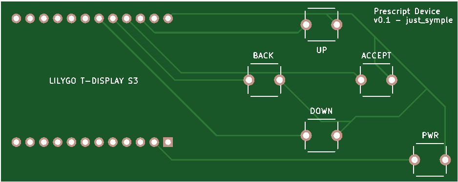

# Custom PCB Information

If you would like to use the custom PCB, you will need to order it from a PCB manufacturer. This will cost a couple bucks if this is your first time doing this (and if you choose the cheapest shipping) and you get multiple in case you (or the company) make a mistake. 

The PCB files needed are located in the [1PCBFILES folder](../1PCBFILES).

I personally used JLCPCB but there are many other similar services that offer great prices.

Then once you receive it, all you have to do is solder the LILYGO T-Display S3 and 5 buttons to the PCB, making sure that none of the pins are bridged. 