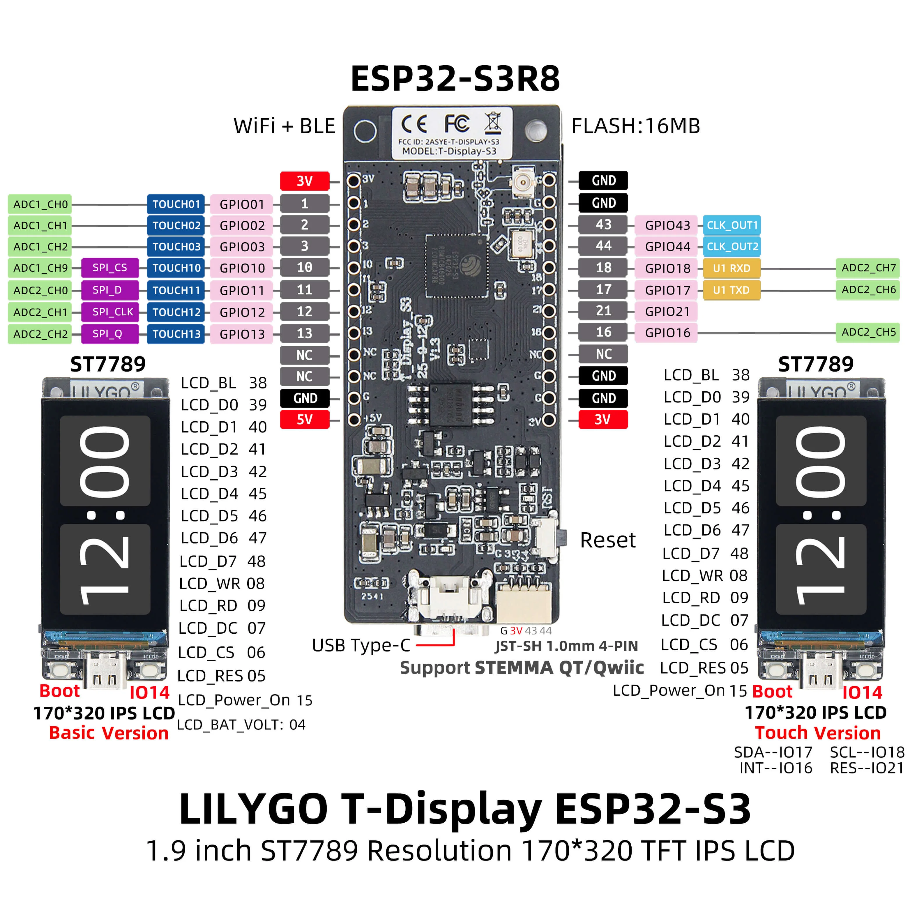

# Wiring Guide
This is the guide for wiring the buttons to the board if you're not using the custom PCB.

On the backside of your LILYGO T-Display S3, there should be pins if you bought the one that has them presoldered. You can attach female-to-female dupont jumper wires to them and the buttons.

This is the pin diagram for this specific board:

If you don't want to make changes to the code, you will need to use:
- the ground pins 
- Pin 1 (sleep button)
- Pin 43 (up button)
- Pin 17 (down button)
- Pin 44 (accept button)
- Pin 18 (back button)

These buttons are required in order to navigate the software. To connect the buttons, attach one of the button legs to ground and the other to the desired pin, this can be done with dupont female-to-female jumper wires or any other method.

If you don't want to use these pins, then refer to the [software modification guide.](softwareinstallation.md#software-modification-guide)