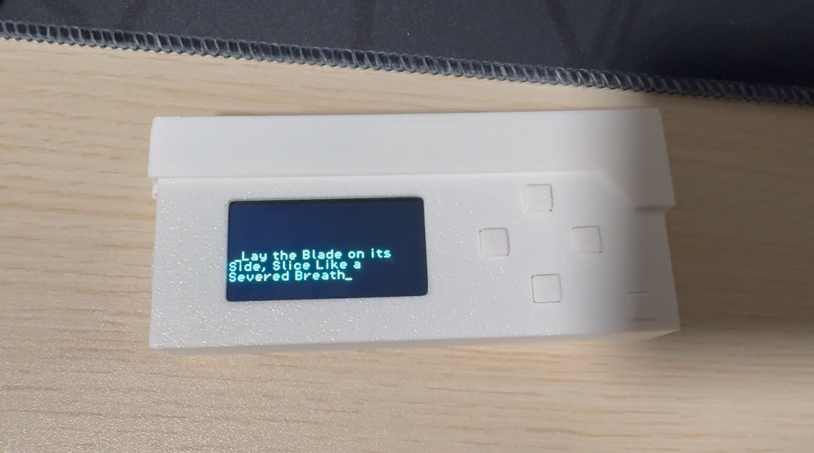

# Symple's Prescript Device

Hello! Welcome to my Limbus Company inspired Prescript Device project! (ignore the lack of paint, i was rushing to get this out)

This project has:

- A fully custom menu system
- Prescript generator (currently shows Rien and HoS Yi Sang's skill names)
- Simple settings (brightness, debug overlays)
- A custom pcb and case (completely optional!)

---
Disclaimer:
This project was 100% human made, no AI was used in the process and never will be. All of the questionable decisions were made by yours truly!!!!

## Materials required to get this project up and running:

- A computer
- LILYGO T-Display S3 (other ESP32 boards may work, but I programmed everything specifically for this board)
- 5 push buttons (with two pins, preferably 6x6x5mm)
- Some way to connect the buttons to the ESP32 board (dupont jumpers, breadboard, etc)

## Optional materials:
- The [custom PCB](1DOCS/pcbinfo.md) and access to a soldering iron and solder
- A 501240 220mAH battery (ensure the polarity is correct before plugging into the board)
- Access to a 3D printer to print the custom case [(link to the STL files for printing)](/1CASEFILES)

## Guides:
### Wiring Guide: [click here!](1DOCS/wiring.md)
### Software Installation and Modification Guide: [click here!](1DOCS/softwareinstallation.md)
### PCB Information: [click here!](1DOCS/pcbinfo.md)
### Case 3D Print Files: [click here!](1CASEFILES/) (BE WARNED THAT I DIDNT MAKE THE SCREW HOLES PROPERLY SO YOU WILL HAVE TO GLUE OR TAPE IT SHUT UNTIL I FIX IT, or someone else fixes it... pretty please flutters my eyes)
---
### And that's all! unless you want to see my plans...
---
### TO-DO (stuff I plan to eventually work on in the future when I get the motivation):
- Implement Coin Flipping with custom Limbus Company-like sprites.
- Add a custom text wrapping function to replace the wordwrap library so that i can properly center the text.
- Add a battery indicator.
- Make the Prescripts easily editable, instead of hard-coded.
- Add a better way of adjusting brightness(?)
- Organize code into separate files(?)
